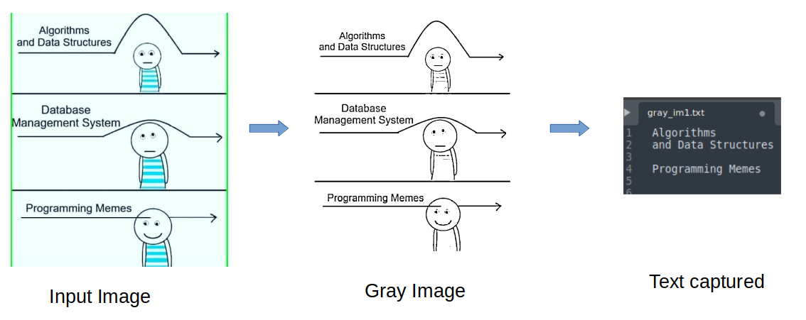

# ssc_tesseract
Python script to extract text from images using Tesseract


### Here we have tried to optimize the script which allows user to:
<ol>
<li>Extract text from image using pytesseract
<li>Convert the text to desired language using GoogleTranslator
<li>Get a summary of results
</ol>


### usage

```console
user@user:~$ python image_to_text.py -i images/*.jpg -p 3 -l eng -t en -o out
```
```console
user@user:~$ python image_to_text.py -h
usage: ch9.py [-h] -i IMAGE [IMAGE ...] [-l eng] [-t de] [-p 3] [-o OUTPUT]

Python script to extract text from images after converting them to grayscale

options:
  -h, --help            show this help message and exit
  -i IMAGE [IMAGE ...], --image IMAGE [IMAGE ...]
                        path to the input image/images --required
  -l eng, --lang eng    text language type (default: eng)
  -t de, --to de        language to translate the text
  -p 3, --psm 3         Tesseract PSM mode type (default: 3)
  -o OUTPUT, --output OUTPUT
                        Output folder path (default: /home/user/Downloads/ssc_tesseract)
```

### Example


### Major changes
<ul>
<li>Appened the arguments - lang and psm in the pytesseract function</li>
<li>Generated the main function, initiating argparser with variable check</li>
<li>Generated functions like img_to_gray(img_name, img_name_gray, output_folder), google_translate(text, text_translated, args) etc</li>
<li>Try Except used while reading file to avoid exception</li>
<li>Providing img list as user input</li>
<li>Formatted the help module with better output and user input checks</li>
<li>Appended --out argument to provide output folder, cleaner results</li>
<li>Generating summary.csv to provide comprehenisve results analysis</li>
<li>Generated requirements.txt with all required packages with version</li>
</ul>

### Minor changes
<ul>
<li>Removed unused libraries</li>
<li>More intuitive variable naming</li>
<li>Updated comments</li>
<li>Using double quotation from both single and double</li>
<li>File closing after completion</li>
<li>String interpolation</li>
<li>Updated rsplit to fetch filename</li>
<li>Append text.strip() to make sure empty output is not printed</li>
</ul>


### Other changes
<ul>
<li>Removed str(translated) text output from GoogleTranslator as it is already of class string</li>
<li>Updated psm default value to 3 since giving good results</li>
<li>Updated import wand.image import Image to only Image</li>
<li>Removing the paranthesis from (GoogleTranslator)</li>
</ul>

### Further enhancements
<ul>
<li>Argument such as --verbose may be provided to allow user to have the printed outputs or not</li>
<li>Percentage completion bar to depict the overall progess may be provided</li>
</ul>